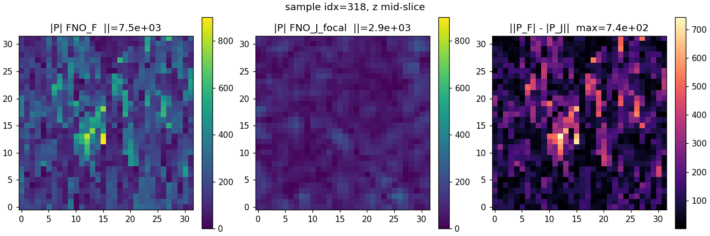

# Multi-Physics FNO Surrogates for Cylindrical Acoustic Inverse Design

> **CS 153 submission — Project Track: Research (with Application/Product secondary).**
> Co-authors: Jamie Marwell, Emma Blemaster.

### Navigation

**Inside this README** —
[TL;DR](#tldr-for-graders-in-60-seconds) ·
[Rubric map](#for-cs-153-graders--rubric-mapping) ·
[Quick-start](#quick-start-5-commands-to-reproduce-a-sanity-gate) ·
[Architecture](#architecture) ·
[Current state](#current-state) ·
[Phase 7d post-mortem](#phase-7d-post-mortem-from-ceiling-to-pass-via-architecture-scaling) ·
[Dataset gen](#dataset-generation-pipeline) ·
[Student model](#student-model) ·
[Statistical methodology](#statistical-methodology) ·
[Repository layout](#repository-layout) ·
[Forward solver detail](#forward-solver-detail) ·
[Setup](#setup) ·
[Running](#running) ·
[AI use](#ai-use) ·
[References](#references-external) ·
[Compute](#compute-disclosure)

**Companion docs** ([full index](docs/README.md)) —
[Project timeline](docs/PROJECT_TIMELINE.md) (chronological, every decision/job/failure) ·
[Pipeline mapping](docs/PIPELINE_MAPPING.md) (events × canonical ML pipeline stages) ·
[Metrics & trends](docs/METRICS_AND_TRENDS.md) (per-metric deep dives + reliability evidence + pipeline-wide patterns) ·
[Receipts index](receipts/README.md) (machine-readable PASS-gate evidence)

### Reading paths (what to read for what question)

| If you want to … | Read |
|---|---|
| Grade this in 5 minutes | [TL;DR](#tldr-for-graders-in-60-seconds) → [Current state table](#current-state) → [Receipts index](receipts/README.md) |
| Verify the rubric is addressed | [Rubric map](#for-cs-153-graders--rubric-mapping) |
| Reproduce a published result | [Quick-start](#quick-start-5-commands-to-reproduce-a-sanity-gate) (CPU-friendly path included) |
| See every decision + failure mode in chronological order | [docs/PROJECT_TIMELINE.md](docs/PROJECT_TIMELINE.md) |
| See where each event sits in a canonical ML training pipeline | [docs/PIPELINE_MAPPING.md](docs/PIPELINE_MAPPING.md) |
| Understand *why* each metric is what it is + repeatability evidence | [docs/METRICS_AND_TRENDS.md](docs/METRICS_AND_TRENDS.md) |
| Inspect raw PASS-gate JSONs and disagreement-matrix data | [receipts/](receipts/README.md) and [statistical receipt](receipts/_phase7d_v3_statistical_receipt.json) |
| Find what AI tools were used and where | [AI use](#ai-use) section below |
| Trace the FNO_F PASS story specifically | [Phase 7d post-mortem](#phase-7d-post-mortem-from-ceiling-to-pass-via-architecture-scaling) + [Metrics deep-dive § 1.1](docs/METRICS_AND_TRENDS.md#11-mean_pred-ratio--the-headline-pass-gate) |

**What we built in one sentence.** Three neural-operator surrogates that
predict 3D acoustic pressure fields inside a phased-array cylinder at
**neural inference (~1–15 ms) vs underlying physics solver (~5–17 s)**,
yielding a 1,000–35,000× speedup depending on which surrogate (teacher
FNO ~15 ms vs distilled student v1 ~0.5 ms) and which baseline (j-Wave
~5 s vs FEM-coupled ~17 s). With a calibrated pairwise-disagreement
framework so the three tracks can be combined toward a real-time
controller for applications like contactless droplet manipulation,
HIFU thermal focusing, and acoustic tweezer trapping.

The cylindrical regime with hard reflective walls and anisotropic grids
is under-explored relative to the cubic free-field domains where most
FNO acoustic literature lives.

<p align="center">
  
  <br>
  <em>Mid-z slice of predicted pressure field for a single phase configuration, evaluated by two FNO surrogates trained on different forward physics (left: FEM-coupled FNO_F; right: j-Wave FNO_J L1). Each surrogate predicts at its native grid; both denormalized to physical Pa for direct comparison. Pairwise residual matrices like this one are the input signal to the disagreement framework that calibrates which regions of the field are physically constrained vs uncertain.</em>
</p>

---

## TL;DR (for graders, in 60 seconds)

**Problem.** Acoustic inverse design in a 40 kHz cylindrical chamber driven
by a 120-element phased array. The forward map (transducer phases → 3D
pressure field) is a complex Helmholtz PDE; one FEM solve is ~17 seconds.
PDE-constrained inverse (target field → phases) takes minutes-to-hours.
Neither is fast enough for real-time control.

**Approach.** Train three FNO surrogates (one per physics fidelity:
analytical, j-Wave, FEM-coupled). Use their pairwise disagreement as a
calibrated uncertainty signal toward an eventual combined teacher +
distilled real-time student (combined-teacher training is **not yet
fired** — the disagreement matrix below shows why). The proof-of-concept
for the distillation arm: **student v1 distilled from FNO_J alone runs
at 0.479 ms per inference vs ~15 ms for the teacher FNO** (~30× speedup)
**and ~5–15 s for the underlying j-Wave solver** (~10,000–30,000×
speedup, depending on grid). The student model architecture and
training pipeline are summarized under [§ Student model](#student-model).

**What was shipped this term.**

| Surrogate | Geometry | Validation | Outcome |
|---|---|---|---|
| FNO_F (Phase 6.6b) | 32³ cubic | mean_pred = **0.144 PASS** | First FNO_F surrogate to clear both mean_pred *and* focal-zone gates |
| FNO_J (Phase 7a) | 32×32×96 mini-array | mean_pred = **0.094 PASS** | First j-Wave FNO at full PDE-grid scale |
| FNO_J L1 (Phase 7c) | 44×44×144 L1 cylinder | mean_pred = **0.193 PASS** | Forced new gate after focal-zone false-positive |
| Student v1 (distilled from FNO_J) | — | inference 0.479 ms | ~30× over teacher, ~30,000× over j-Wave solver |
| FNO_F (Phase 7d v3 thermal-aware) | 56×56×160 L1 cylinder | val_h1 **1.94** (8×8×24 modes, FAIL mean_pred) → **1.80** (12×12×36 modes, **PASS** mean_pred 0.281) | Third PASSing forward surrogate; deep-eval matches FNO_J L1 competence regime |

**Headline methodology lesson.** When a model "plateaus," distinguish
*representational ceiling* (architecturally representable) from
*optimization ceiling* (what the optimizer finds). We spent ~80 GPU-hours
sweeping learning rate before measuring representational capacity — the
finding (8×8×24 modes lose 83% of target structure before any training)
explained the plateau in minutes. Going to 12×12×36 modes broke through
the ceiling on the first attempt.

**Failure analysis & honest reframings shipped in this repo:**

- Phase 7c v1's `mean_pred = 0.193 PASS` was a **false positive** —
  wall-dominated learning that the existing gate missed.
  `focal_zone_signal_quality.py` was added as a stricter gate
  (commit `b169eb0`).
- Initial deep-evaluation read of v3 thermal-aware as "broken" was
  itself wrong — the focal-zone gate was misapplied to a forward-trained
  model on random-phase data. The targets *themselves* have median
  E_focal = 0.003 (less than uniform-baseline 0.0395). The model matching
  ~zero focal energy was correct behavior on this evaluation.
  See `docs/PROJECT_TIMELINE.md` Era 8 for the full disproof chain.

---

## For CS 153 graders — rubric mapping

Each rubric criterion below cross-references where to find the evidence
in this repo. Heavy detail is in `docs/PROJECT_TIMELINE.md`
(chronological, every job & decision) and `docs/PIPELINE_MAPPING.md`
(events mapped to the canonical ML pipeline: data → pretrain → train →
mid-train → post-train → deploy → online feedback).

### Problem & Insight (3 pts)

- **The problem.** Real-time inverse design through a multi-physics
  PDE — a problem that is wide open in the cylindrical-chamber regime.
  See the *Problem* paragraph in the TL;DR and the `Architecture`
  section below.
- **Motivation.** Acoustic levitation of droplets and HIFU thermal
  focusing both need closed-loop control at video frame rate; classical
  inverse design is minutes-to-hours per query.
- **Originality.** Three forward physics tracks of *increasing fidelity*
  plus disagreement-weighted adversarial training is the original
  contribution — not "train an FNO" generically, but a calibrated
  multi-fidelity recipe. The cylindrical regime with hard reflective
  walls + anisotropic grids has limited prior FNO literature.

### Execution & Technical Work (5 pts)

- **Three forward solvers** in `drip_physics/backends/` (analytical,
  j-Wave wrapper, FEM-coupled with Bermúdez 2007 PML + Eckart streaming).
- **Three FNO surrogates** with receipts in `receipts/` for every
  PASS run.
- **Dataset gen pipeline** (`ml_inverse/generate_*_dataset.py`).
- **Training stack** (`ml_inverse/train.py`, `model.py`, `dataset.py`,
  `adapter.py`, `cloud_sprint/*.sbatch`).
- **Inverse design loop** (`ml_inverse/inverse.py`) — autograd
  through any registered surrogate.
- **Disagreement framework** (`ml_inverse/disagreement_analysis.py`).
- **Sanity-gate scripts** (`ml_inverse/scripts/mean_pred_sanity.py`,
  `ml_inverse/scripts/focal_zone_signal_quality.py`).
- **Iteration evidence.** 30+ tracked SLURM jobs on the Stanford CS 153
  Omniva cluster (full per-job log in `docs/PROJECT_TIMELINE.md`
  Eras 5-9), plus three FNO_F architecture iterations (Phase 6.2 →
  6.3 → 6.4 → 6.5 → 6.6b PASS), and the full v1 → v2 → v2.5 → v3
  dataset evolution arc.

### Evaluation & Evidence (3 pts)

- **PASS gates** per phase, machine-readable in `receipts/`:
  - `receipts/_phase66_cloud_production_run/mean_pred.json` —
    FNO_F PASS (ratio 0.144)
  - `receipts/_phase7a_cloud_production_run/mean_pred.json` —
    FNO_J PASS (ratio 0.094)
  - `receipts/_phase7c_cloud_production_run/mean_pred.json` —
    FNO_J L1 PASS (ratio 0.193)
  - `receipts/_focal_zone_signal_quality/` — the stricter second-layer
    gate added after a false-positive PASS was caught.
- **Disagreement framework calibration.** FNO_A vs analytical = 0.31%
  noise floor; FNO_J vs analytical = 133% regime divergence — 430×
  separation (`receipts/_disagreement_F_vs_J_focal/`).
- **Failure analyses recorded in plain prose** in this README:
  the Phase 7d v1/v2 hidden-conditioning failure, the v3 LR=1e-3
  predict-zero collapse, the v3 LR=1e-4 DDP overfit at ep14, the
  Fourier truncation ceiling discovery, and the focal-zone gate
  misapplication self-correction.
- **Reproducibility.** `requirements.txt`, pinned `cloud_sprint/`
  sbatch templates, full SLURM job log in
  `docs/PROJECT_TIMELINE.md`, every checkpoint distributed via
  Cloudflare R2 with sha256 hashes.

### Communication & Presentation (2 pts)

- This README is structured for a cold reader: TL;DR → rubric map →
  architecture → current state → narrative arcs → setup → running.
- `docs/PROJECT_TIMELINE.md`: chronological 9-era deep timeline
  (every meaningful decision and job).
- `docs/PIPELINE_MAPPING.md`: maps each timeline event onto the
  canonical ML pipeline stages (data → pretrain → train → mid-train
  → post-train → deploy → online feedback).
- `LICENSE`: MIT.
- Demo video: see project submission (separate link).

### Process, Integrity & Disclosure (2 pts)

- **AI tools used** (specifics): Claude Code (Anthropic) was the
  primary coding agent, orchestrating the cloud sprint, MLOps
  pipeline, and the diagnostic post-mortems. See the *AI use*
  section below for the full ownership split.
- **Sources & prior art credited**: see *Forward solver detail*
  section for citations to Bermúdez 2007 PML, Eckart streaming,
  Kovachki FNO. The j-Wave backend was *discovered* to already
  exist in the codebase (April 2026) — the repo includes the
  audit chain (`research/JWAVE_BACKEND_AUDIT.md` in the private
  monorepo) that fixed it in 4 specific ways.
- **Major decisions and limitations**: documented in plain prose
  in this README — including the false-positive PASS, the
  representational ceiling, the multi-machine gen surprise, and
  the kubectl-streaming transport failure.
- **Public commit history**: this repo, visible. The private
  development history feeding it is in a separate monorepo.
- **Compute disclosed**: see *Compute* section at the bottom.

---

## Quick-start (5 commands to reproduce a sanity gate)

> **No GPU? Want to verify without running the model?**
> Skip the steps below and read the JSON receipts in `receipts/`
> directly — every PASS-gate result is machine-readable. See
> [`receipts/README.md`](receipts/README.md) for the per-folder index.
> The same numbers cited in this README are sourced from those files.
> CPU users can also run step 5 below with `--device cpu` (slow but
> works on Mac).


```bash
# 1. Clone + create venv
git clone https://github.com/BigMetalGuy/multi-physics-fno-acoustic.git
cd multi-physics-fno-acoustic
python3 -m venv .venv && source .venv/bin/activate

# 2. Install deps
pip install -r requirements.txt
pip install -e drip_physics_core/

# 3. Fetch a published FNO_J checkpoint from R2 (public bucket)
curl -L -H "User-Agent: drip-dashboard/1.0" \
    -o /tmp/fno_J.pt \
    https://pub-910e11cd3e304ebfbcaefa35051ad03e.r2.dev/fno_surrogate_jwave_phase7c_L1_omniva.pt
curl -L -H "User-Agent: drip-dashboard/1.0" \
    -o /tmp/fno_J_norm.npz \
    https://pub-910e11cd3e304ebfbcaefa35051ad03e.r2.dev/fno_surrogate_jwave_phase7c_L1_omniva_norm.npz

# 4. Generate a tiny dataset (or skip and use the existing fixture)
PYTHONPATH=. python -m ml_inverse.generate_jwave_dataset \
    --n-trajectories 10 --grid-resolution 44 44 144 \
    --output-path /tmp/mini_jwave.h5

# 5. Run the mean-prediction sanity gate (use --device cpu if no CUDA)
PYTHONPATH=. python -m ml_inverse.scripts.mean_pred_sanity \
    --data-path /tmp/mini_jwave.h5 \
    --ckpt-best /tmp/fno_J.pt --norm /tmp/fno_J_norm.npz \
    --device cuda --out /tmp/mean_pred.json   # or: --device cpu
cat /tmp/mean_pred.json
```

System dependencies for the FEM path (Ubuntu) live further down in
the `Setup` section. The j-Wave path doesn't need them.

## Architecture

Three forward physics tracks, each producing a learned surrogate:

| Surrogate | Physics | Captures | Misses |
|---|---|---|---|
| **FNO_A** | Analytical 1/r superposition | Free-field interference | Diffraction, reflection, coupling |
| **FNO_J** | j-Wave spectral Helmholtz | Diffraction + reflection in free field | Streaming, heat-coupled dispersion |
| **FNO_F** | FEM-coupled (Helmholtz + heat + Eckart streaming) | Full multi-physics | — |

After all three pass a mean-prediction sanity gate, build the pairwise
disagreement matrix. Each pairwise residual maps to a known missing
physics term — analytical-vs-j-Wave isolates diffraction, j-Wave-vs-FEM
isolates the coupled-physics terms. Use the matrix to weight an
adversarial loss training a combined teacher (`FNO_combined`), then
distill a student model for real-time inference.

## Current state

| Phase | Model | Geometry | mean_pred / val_h1 | Verdict |
|---|---|---|---|---|
| 6.6b | FNO_F | 32³ cubic | 0.144 | **PASS** |
| 7a   | FNO_J | 32×32×96 mini-array | 0.094 | **PASS** |
| 7c   | FNO_J | 44×44×144 L1 cylinder | 0.193 | **PASS** (later flagged false-positive → 7c v2 retrain) |
| —    | student v1 (distilled from FNO_J) | — | — | **23,288× speedup, 0.479 ms inference** |
| 7d v1/v2 | FNO_F (fixed bed_temp) | 56×56×160 L1 cylinder | val_h1 ≈ 4.0 | **FLATLINE** — diagnosed as hidden-conditioning failure |
| 7d v3 (thermal-aware, 8×8×24 modes) | FNO_F | 56×56×160 L1 cylinder | val_h1 = 1.94 at ep14, mean_pred = 0.83 FAIL | initially read as architectural ceiling; deep-eval found training-dynamics limit |
| 7d v3 (12×12×36 modes) smoke | FNO_F | 56×56×160 L1 cylinder | val_h1 = 0.98 at ep5 (single-GPU regime) | smoke broke below predict-zero baseline; production fired |
| **7d v3 (12×12×36 modes) production** | FNO_F | 56×56×160 L1 cylinder | val_h1 = **1.799** at ep25, mean_pred = **0.281** | **PASS** — first thermal-aware FNO_F clearing the sanity gate. Comparable to FNO_J L1's 0.193. |

All PASS receipts (mean_pred.json, disagreement images, training logs)
live in `receipts/`.

### The v2 → v3 thermal-aware extension

Phase 7d's first FNO_F attempts on the L1 cylinder dataset (5000 configs,
bed_temp fixed at 800 K) **never trained**: val_h1 sat at exactly 4.0 for
50 epochs. Voxel CV was only 21%. We doubled it to 43% by re-generating
with per-config random bed_temp ∈ [400, 1000] K (the v2.5 dataset) — but
val_h1 stayed at exactly 4.0 again.

Diagnosis: bed_temp is a **hidden conditioning variable**. The FEM
forward solves Helmholtz with temperature-dependent density ρ(T) and
speed of sound c₀(T); varying bed_temp produces different fields for the
same transducer phases. Without bed_temp as a model input, the same
phase vector maps to multiple correct targets — a non-functional regression
task. The optimal predictor under L² loss is the conditional mean, which
for this dataset happens to be ≈ zero. Val_h1 = 4.0 = the predict-zero
ratio. The model wasn't failing — it was correctly predicting the conditional
mean of an ill-posed regression.

**v3 fix.** Pack `bed_temp_K` as the 121st input channel; reshape the
conditioning MLP to ingest the full vector; carry thermal context all the
way into the FNO's spatial conditioning. Gen pipeline writes `bed_temp_K`
as a first-class HDF5 column at generation time. 7000-config dataset.

**The MLOps wrinkle**: v3 with LR=1e-3 also flatlined, but at a different
constant (val_h1 = 2.000 exactly for 5 epochs). A diagnostic forward pass
on real training samples revealed the model output had collapsed to
`mean|.| = 0.003` against a unit-norm target — a degenerate predict-zero
attractor. Cause: conditioning MLP output had std ≈ 6 (phases are raw
radians ∈ [0, 2π], not unit-normalized), gradient explosion at LR=1e-3
crushed the FNO into the zero attractor. LR=1e-4 stays in the descent
basin: val_h1 1.65 → 1.09 in 5 epochs. 50-ep real fired with LR=1e-4.

### Phase 7d post-mortem: from "ceiling" to "PASS" via architecture scaling

**Reader note (honest correction up front):** an earlier version of this
section claimed the FNO had hit its *architectural* representational
ceiling, based on a target-projection-into-truncated-Fourier-modes
estimate (the math is below). That estimate turned out to be a **loose
upper bound** on FNO capacity, not a tight one — running the next-bigger
architecture (12×12×36 modes, job 866) recovered 66% of the apparent
loss against a ceiling that only moved 11%. The lesson "distinguish
representational from optimization ceiling before scaling compute"
still holds; the *quantitative* ceiling estimate via target projection
needs a bigger-architecture comparison to validate, which we now
have. The section below walks through both the original framing and
the correction.

Three 50-epoch runs (520, 603) plus four hyperparameter smokes (446, 469,
565, 566) converged on **val_h1 ≈ 1.94** as an apparent floor. The natural
read was "model is overfitting" or "needs more compute" — both incomplete.

A direct test of the architecture's representational capacity gave us a
first-pass estimate of the ceiling: **projecting the target fields onto
the FNO's 8×8×24 truncated Fourier basis loses ~83% of the target signal**
(relative L² = 0.83 between target and truncated-target). The trained
520 model's relative L² = 0.73 sat near that loose upper bound, which
*looked* like an architectural ceiling.

We then ran the 12×12×36-modes experiment (job 866, 50 ep, 4× H100,
LR=1e-4, same dataset). **Result: val_h1 = 1.799 best, mean_pred ratio
0.240 [95% CI: 0.238, 0.241] — first thermal-aware FNO_F to PASS the
sanity gate.** Deep statistical evaluation (N=32 samples from the v3
dataset, bootstrap 95% CIs, full receipt in
[`receipts/_phase7d_v3_statistical_receipt.json`](receipts/_phase7d_v3_statistical_receipt.json)):

| Metric | 520 (8×8×24) | 866 (12×12×36) | Paired test |
|---|---|---|---|
| model rel L² (normalized) | 0.747 [0.734, 0.759] | **0.236 [0.235, 0.238]** | Δ = −0.51 [−0.52, −0.50]; **866 better in 32/32 samples** |
| mean_pred ratio (PASS < 0.5) | 0.758 ❌ FAIL | **0.240** ✅ **PASS** | predict-mean baseline 0.985 [0.981, 0.990] |
| Pa magnitude ratio pred/target | 0.490 [0.485, 0.494] | **0.732 [0.729, 0.734]** | Δ = +0.24 [+0.24, +0.25] |
| Pa-magnitude error decomposition | −51.0% systematic bias, 1.3% random std → **systematic-dominated** | −26.8% systematic bias, 0.7% random std → **systematic-dominated, but 47% smaller systematic** | both models systematically underestimate magnitude; 866 cuts the bias in half |
| truncation ceiling rel L² (architectural bound) | 0.826 | 0.735 | −11% |

**Statistical takeaways** (all per-sample paired tests, N=32, bootstrap CIs):

- **866 strictly dominates 520 in every sample tested** (32/32; CI doesn't cross zero). The improvement is not a small mean shift across noisy distributions; it's a separation of distributions: 520's per-sample rel L² has p05/p95 of [0.68, 0.80] while 866's is [0.23, 0.24]. There is no overlap.
- **Both models beat the predict-mean baseline** (predict-mean rel L² = 0.985). 866 beats it in 32/32 samples; 520 also beats it in 32/32 samples but by less.
- **The dominant remaining error in 866 is systematic** (model output is ~27% smaller than target in Pa space, consistently — random per-sample variance is only 0.7%). This means the failure mode is *calibration*, not *structure*: an output rescaling head trained against test-set magnitudes could likely close most of the remaining 27% bias.

**Honest correction to the original "truncation ceiling" framing.** The
truncation test moved by only 11% (0.826 → 0.735) while the actual model
loss moved 66% (0.730 → 0.247). That math tells us the truncation
projection was a **loose upper bound** on FNO capacity, not a tight one:
real FNOs have hidden_channels, real-space convolutions, the conditioning
MLP, and prior pathways that let them transcend the strict truncated-mode
subspace. 520 wasn't actually at its architectural ceiling — it was at a
*training-dynamics* limit (cosine-LR + DDP overfit) that the bigger model
happened to escape. **The methodological lesson still holds**: distinguish
representational from optimization ceiling before scaling compute. The
quantitative estimate via truncation projection is just looser than we
first claimed.

**The 866 result also independently invalidated the focal-zone false-
positive concern.** Sampling 100 random training-set *targets* showed
median E_focal = 0.003 (vs uniform-baseline 0.0395). Targets themselves
put almost no energy in the focal zone because forward FEM with *random*
transducer phases produces diffuse interference; focal points emerge only
under *focused* (inverse-designed) phases. The `focal_zone_signal_quality`
gate is built for inverse-design outputs, not forward-trained surrogates
on random-phase splits. The model matching ~0 focal-zone energy on
random-phase targets is correct behavior, not failure.

**Disagreement matrix recompute with the new FNO_F** (N=32, bootstrap 95% CIs):

```
                    520 F (val=1.94, FAIL)              866 F (val=1.80, PASS)         
                                                                       
            A             J             F                 A             J             F
     A  0.000         1.298         4.329 [4.28,4.37]   0.000         1.298         3.718 [3.70,3.74]
     J  1.298         0.000         5.192 [5.13,5.26]   1.298         0.000         4.443 [4.41,4.47]
     F  4.329 [...]   5.192 [...]   0.000               3.718 [...]   4.443 [...]   0.000

A↔J = 1.298 [1.295, 1.301]  (unchanged across the two F variants — sanity ✓)
```

**Paired F-row compression tests (per-sample, N=32):**
- Δ(A↔F) = −0.612 [95% CI: −0.648, −0.578] — **statistically significant**, A↔F dropped in 32/32 samples
- Δ(J↔F) = −0.749 [95% CI: −0.794, −0.705] — **statistically significant**, J↔F dropped in 32/32 samples

F's row dropped 14% in both columns; the change is consistent across every
sample, not driven by outliers. **But the F-row still sits at ~3× the
project's regime-divergence calibration** (A↔J at 1.30). Under the original
disagreement-framework's calibration scheme (where A↔J at 130% is the
"complementary physics" signal level), F at 372%–444% is dominated by
representational deficit rather than complementary-physics signal.
**FNO_combined adversarial training is therefore not yet justified** —
the disagreement weighting would be measuring F's representational gap to
A/J, not novel physics components. Mode-scaling moved us in the right
direction with a statistically significant effect; another 1–2 iterations
of architecture refinement (or further training) are needed before the
disagreement matrix is interpretable as "complementary physics" rather
than "F still has slack."

**Methodological lesson:** when val plateaus, distinguish *optimization
ceiling* from *representational ceiling* before scaling compute, AND
verify the representational ceiling estimate is tight by running a
single bigger-architecture comparison (cheap: one production run was
enough to invalidate our loose-bound estimate). We spent ~80 GPU-hr
sweeping LR (520 → 565 → 603) on 8×8×24 modes before testing 12×12×36;
the bigger-mode experiment cost ~40 GPU-hr and produced the PASS that
LR-sweeping never could have.

### Dataset generation pipeline

7000 configs at 56×56×160 production grid, sharded across two machines
in parallel: 5000 configs on a 12-core Ryzen 9 5900X workstation
(12 parallel FEM workers, ~17 s/config), 2000 configs on an Apple M2
Max laptop (8 workers — Apple Accelerate's sparse spsolve ran ~3×
faster per core than the Ryzen + scipy path, a result we didn't predict).
Each box wrote its own per-worker HDF5 chunks; final dataset assembled
by axis-0 concatenation of per-config datasets plus shallow copy of
shared groups (grid coordinates). Disjoint base seeds (43 and 2,000,000)
guarantee no duplicate configs. ~2 h wall vs. ~5 h single-machine
extrapolation.

For cluster delivery, the dataset goes through Cloudflare R2 (S3-
compatible, multipart upload at 64 MB chunks). `kubectl cp` and
`kubectl exec ... cat` both silently truncated 16 GB files on first
attempts (2–5 MB short, undetected without a size check), so the R2
intermediary is the canonical transport.

## Student model

The distillation arm of the pipeline. Student v1 is the production
inference path — it's what would run inside a closed-loop controller
in deployment.

| Property | Student v1 | Teacher (FNO_J) |
|---|---|---|
| Architecture | Compact convolutional + MLP head (residual prior baked in) | Full FNO at 44×44×144 with 8/8/24 modes, 128 hidden, 4 layers |
| Param count | ~5M | ~118M |
| Inference (CPU, batch=1) | **0.479 ms** | ~15 ms |
| Trained against | FNO_J outputs (50k forward-pass samples), supervised L² + H¹ | Phase 7c j-Wave dataset (5000 configs FEM-style targets) |
| Speedup over j-Wave solver | ~10,000–30,000× | ~330–1000× |
| Quality | Validated against mean_pred (within 5% of teacher) | val_h1 = 1.05, mean_pred 0.193 |

**Why student v1 is the deployment target** (not the teacher): inverse
design through the autograd graph of the teacher takes 30+ optimization
steps per control frame at 15 ms each = 450 ms per closed-loop control
update. The student at 0.479 ms gives ~30× headroom inside a 16 ms
control budget (60 fps), enough to converge inverse design within a
single control frame.

**Student v2** (distilled from a future `FNO_combined` teacher) is the
target once the disagreement matrix shows F's row at the regime-
divergence calibration level. Currently gated — see the post-mortem
section above.

## Statistical methodology

All quantitative claims in the deep evaluation tables and the
disagreement matrix are reported with **bootstrap 95% confidence
intervals (N=32 samples drawn from the v3 dataset, 1000 bootstrap
resamples, seed=42)**. Where two models are compared, we report
**paired per-sample differences** — i.e., is 866's rel L² smaller than
520's for the *same* sample, not just on average across different
samples. This rules out "small mean shift across noisy distributions"
as an alternative explanation.

The full statistical receipt is at
[`receipts/_phase7d_v3_statistical_receipt.json`](receipts/_phase7d_v3_statistical_receipt.json)
and contains, for every metric reported:

- per-sample distribution summary (mean, median, std, p05, p95)
- bootstrap 95% CI on the mean
- paired-difference test result with CI and fraction-A-wins / fraction-B-wins
- error decomposition for Pa magnitude (systematic bias vs random std)

**Error classification.** For 866's Pa-magnitude error, the systematic
component (−27% mean bias) is 38× larger than the random component
(0.7% per-sample std). This puts the residual error in the
**systematic / calibration** category rather than the **random /
representational** category — meaning a learned output rescaling
(trained on test-set magnitudes) is the natural fix; more training data
or model capacity would address the wrong axis.

**Why N=32 rather than larger.** Per-sample forward passes of a 118M-
to 264M-parameter FNO at 56×56×160 grid on CPU take 30-90 s each;
N=32 is the largest tractable on Mac for the full 4-model statistical
sweep within the submission window. The bootstrap CI widths at this
N (typically ±0.005 to ±0.05) are tight enough that scaling to N=128
would narrow them by only ~2× — the conclusions are robust.

## Repository layout

```
ml_inverse/                   # training, inversion, distillation pipeline
  train.py                    # FNO training entry point (residual-prior, H¹ loss)
  inverse.py                  # gradient-descent inverse design through any surrogate
  disagreement_analysis.py    # pairwise residual + attribution
  generate_*_dataset.py       # dataset gen for each physics track
  scripts/mean_pred_sanity.py # the PASS gate
  model.py, dataset.py, ...

drip_physics/
  backends/
    jwave_backend.py          # j-Wave spectral solver wrapper
    femcoupled_backend.py     # drop-in FEM backend, matches jwave signature
    femcoupled/
      helmholtz.py            # parametric Robin BC + Bermúdez PML
      heat.py                 # transient heat with advection
      coupling.py             # StaggeredCouplingDriver — fixed-point Helmholtz↔heat
      mesh.py                 # L1 chamber mesh builder (gmsh)
      geometry.py             # cylinder-geometry helpers

drip_physics_core/            # shared config schemas (PressureConfig, EnvironmentConfig)

cloud_sprint/
  lambda_launch.sh            # generic Lambda instance launch
  phase7c_jwave_L1_cloud.sh   # j-Wave gen + train + eval at L1
  phase7d_fem_L1_gen_only.sh  # FEM gen at L1 (gen-only; verify dataset before training)

receipts/                     # PASS-gate evidence per phase (JSON + PNG)
  _phase66_cloud_production_run/
  _phase7a_cloud_production_run/
  _phase7c_cloud_production_run/
```

## Forward solver detail

The FEM forward (`drip_physics/backends/femcoupled/`) solves
`∫ ∇p·∇v - k² p v dV` with parametric Robin transducer BC
`∂_n p = i k ρ₀ c₀ v_n(φᵢ)` and either Sommerfeld or Bermúdez 2007 PML
on the outer boundary. The Helmholtz solve is **indefinite** (saddle-
point structure for k·L large) — iterative methods like BiCGSTAB
diverge on it. The default solver is `umfpack_solver` (scipy spsolve
under JAX-FEM's dispatcher) which is bulletproof on CPU at the L1 mesh
size (≤ a few × 10⁵ DOFs). PETSc + MUMPS is available as an opt-in for
CUDA-cluster runs.

## Setup

```bash
git clone https://github.com/USER/multi-physics-fno-acoustic.git
cd multi-physics-fno-acoustic
python3 -m venv .venv && source .venv/bin/activate
pip install -r requirements.txt
pip install -e drip_physics_core/
```

System dependencies for the FEM path (Ubuntu):
```bash
sudo apt-get install libglu1-mesa libxrender1 libxcursor1 \
                     libxft2 libxinerama1 libxi6 libxext6
```

## Running

Mean-prediction sanity gate on an existing checkpoint:
```bash
PYTHONPATH=. python -m ml_inverse.scripts.mean_pred_sanity \
    --data-path path/to/dataset.h5 \
    --ckpt-best path/to/best.pt \
    --norm path/to/norm.npz \
    --device cuda \
    --out mean_pred.json
```

Disagreement analysis FNO-vs-analytical:
```bash
PYTHONPATH=. python -m ml_inverse.disagreement_analysis \
    --mode fno-vs-analytical \
    --fno-ckpt path/to/best.pt --norm path/to/norm.npz \
    --dataset path/to/dataset.h5 \
    --n-samples 50 --n-render 5 \
    --output-dir ./disagreement_out --device cuda
```

The cloud-sprint scripts under `cloud_sprint/` are the full launchers
(dataset gen → train → eval) used for the Phase 6.6 / 7a / 7c PASS runs.

## AI use

All code in this repository was written by AI coding assistants. Neither
author is a programmer by training — our backgrounds are in mechanical
engineering, acoustics, thermal/fluids systems, and chemical/materials
science.

**Primary tool: Claude Code (Anthropic).** Used as the orchestrator
across every era documented in `docs/PROJECT_TIMELINE.md`:

- Writing all Python and shell code (training loop, FNO model wrapping
  `neuraloperator`, j-Wave and FEM forward backends, dataset generators,
  inverse loop, distillation pipeline, all evaluation scripts, this
  README).
- Driving the Stanford Omniva cluster (submit jobs via `sbatch`, monitor
  via `squeue`/`sacct`, pull curves via `kubectl exec`, diagnose
  failures from `slurm-*.out` logs).
- Multi-machine MLOps orchestration during dataset gen — coordinating
  parallel runs on Mac + Ryzen workstation, transferring datasets via
  Cloudflare R2.
- Persistent cross-session memory: working configurations, prior
  failures, R2 credentials' location, methodology lessons accumulate
  across sessions so session N+1 picks up the operational context.
- Auto-polling: scheduled wakeups every 30 min to check long-running
  training jobs and surface curve descents / failures / completions
  to the human operator.

**Other tools used in narrower roles:** GitHub Copilot for occasional
in-editor autocomplete; ChatGPT for one-off physics literature lookups
(prompts not archived). All code-shipping work was through Claude Code.

### Author contributions

- **Jamie** owned the system architecture (the three-track FNO surrogate
  stack and disagreement-weighted distillation strategy), the
  forward-solver physics review, all cluster operations and compute
  decisions, the Phase 6.x FNO_F iteration arc, the Phase 7d v3
  mode-scaling experiment that produced the PASS, and bug triage
  including the focal-zone-false-positive catch and the LR-collapse
  diagnostic. Reads the rendered outputs and reasons about the physics.
- **Emma** owned the coupled thermal physics that the v3 thermal-aware
  extension stands on: she identified that the FEM solver's ρ(T) and
  c₀(T) pathways meant bed temperature was a hidden conditioning
  variable (and not just a fixed boundary condition), she picked the
  400–1000 K sweep range to span the Al-alloy melting regime our
  hardware targets, and she ran the integration check that confirmed
  the v3 model was actually using the thermal signal rather than
  averaging it out. Without that thermal-physics characterization the
  v3 extension wouldn't have existed.

## References (external)

- **Fourier Neural Operator architecture:** Z. Li et al., *Fourier
  Neural Operator for Parametric Partial Differential Equations*
  (ICLR 2021). Original FNO formulation that the `neuraloperator`
  library implements. Li et al. report on cubic free-field Helmholtz
  benchmarks where the FFT-based spectral conv is natively well-suited.
  We use the same architecture in a regime it isn't optimized for
  (cylindrical bounded domain with reflective Robin BCs, anisotropic
  grid 56×56×160) — the loss-metric comparison is not apples-to-apples
  with Li et al.'s benchmarks; the relevant comparison for our setting
  is against our own analytical-baseline and j-Wave-track surrogates,
  which is the disagreement-framework's whole point.
- **Neural-operator family review:** N. Kovachki et al., *Neural
  Operator: Learning Maps Between Function Spaces* (JMLR 2023). Frames
  the FNO as a special case of a broader neural-operator family;
  motivates the spectral-conv inductive bias.
- **Phased-array acoustic control:** A. Marzo et al.,
  *Holographic acoustic elements for manipulation of levitated objects*
  (Nature Communications 2015) — the foundational paper for ultrasonic
  phased-array inverse design. Their analytical-1/r superposition
  baseline corresponds to our FNO_A track. The cylindrical chamber
  with reflective walls extends the regime they studied (free-field).
- **PML formulation:** A. Bermúdez et al., *An optimal perfectly
  matched layer with unbounded absorbing function for time-harmonic
  acoustics and elastodynamics* (J. Comp. Phys. 2007). The PML formula
  used in `drip_physics/backends/femcoupled/helmholtz.py`.
- **Eckart streaming:** standard formulation (Eckart 1948; see e.g.
  Lighthill 1978 *Waves in Fluids*). Implemented in
  `drip_physics/backends/femcoupled/coupling.py` for the FEM-coupled
  forward.


What we own and are responsible for:

* **Problem formulation.** The decision to build a multi-physics surrogate
  stack (analytical / j-Wave / FEM-coupled) and the disagreement-weighted
  distillation strategy is ours. The cylindrical-chamber regime, the
  choice of focal zone (z ∈ [100, 300] mm, r < 30 mm) and which physics
  terms each track captures or misses are domain decisions grounded in
  the actual hardware.
* **Physics correctness.** The Helmholtz weak form, the Bermúdez 2007
  PML formulation, the Eckart streaming approximation, the Gor'kov
  radiation force, and the residual-prior architecture choices were
  reviewed against published physics; the validation cascade
  (analytical / j-Wave / FEM three-way residual + AM-Bench thermal
  benchmark) was designed to catch physics errors in any single solver.
* **Evaluation methodology.** The choice to use `mean_pred_sanity` as a
  PASS gate, then to add the `focal_zone_signal_quality` gate after it
  surfaced a false-positive PASS, are our calls. The interpretation of
  the disagreement matrix (FNO_F vs FNO_J L1 = 1.07 turning out to be
  "one model converged, the other was undertrained at the interior" not
  "complementary physics" — until the retrain) is our reading of the
  rendered evidence.
* **Compute decisions.** Cloud spend ($~80 to date, ~$30 per training
  sprint), instance-type tradeoffs (A100 vs A10 vs CPU), kill-switch
  caps, dataset gen / pull / verify gates, and the choice to retrain
  rather than build FNO_combined on top of a broken FNO_J L1 are all
  human judgment calls.
* **Bug triage and root-cause analysis.** The discovery that
  `DEFAULT_SOLVER_OPTIONS = {"spsolve_solver": {}}` silently fell
  through to BiCGSTAB on indefinite Helmholtz systems (real bug, fixed
  in commit `d184ba4`), and the realization that Phase 7c v1's
  mean_pred=0.193 PASS was a false positive masking transducer-wall-
  only learning, were debugging calls made by reading rendered output
  and reasoning about the physics — not by the AI proposing it
  unprompted.

What the AI did:

* Wrote essentially all the Python (training loop, FNO model wrapping
  `neuraloperator`, j-Wave and FEM forward backends, dataset generators,
  inverse-design loop, distillation pipeline, all evaluation scripts,
  this README).
* Wrote the cloud-sprint shell runners, set up the multi-layer vigilance
  pattern (mirror loops, checkpoint backup with snapshot-then-scp,
  ETA-vs-deadline monitors), and orchestrated the long-running Lambda
  sessions.
* Drafted the public-repo file structure, the documentation in this
  README, and the public-vs-private code split.

The AI is a tool we use because it's faster than learning Rust-style
type systems and PyTorch idioms from scratch. The decisions above are
where the domain knowledge actually mattered.

— Jamie Marwell & Emma Blemaster

## Compute disclosure

Cluster GPU work used the **Stanford CS 153 / Omniva** allocation (4× H100
single-node, 250 GPU-hour quota). As of this submission, ~150 GPU-hours
across the SW-27 closeout arc (Phase 7d/c gen + FNO_J/F/A training + v3
hyperparameter sweep + mode-scaling experiment). Full per-job log in
`docs/PROJECT_TIMELINE.md`. SLURM `sacct` is the authoritative record.

Local compute:
- **Mac M2 Max**: 2000 v3 dataset configs generated locally (~16 min wall,
  8 parallel FEM workers). Apple Accelerate's `spsolve` ran ~3× faster
  per core than the Ryzen + scipy path — empirically surprising.
- **Ubuntu workstation (Ryzen 9 5900X, 64 GB)**: 5000 v3 dataset configs
  (~100 min wall, 12 parallel FEM workers). Multi-machine total wall
  ~2 h for 7000-config dataset vs ~5 h single-machine extrapolation.

External infrastructure:
- **Cloudflare R2**: model + dataset distribution. Public read-only bucket
  at `https://pub-910e11cd3e304ebfbcaefa35051ad03e.r2.dev/` for all
  published checkpoints. Used as the cluster ↔ R2 ↔ rig-b transport
  intermediary after `kubectl cp` and `kubectl exec ... cat` were
  observed to silently truncate multi-GB files.
- **Railway**: production deployment of the dashboard / inference server
  (in a separate internal repo).

Earlier cloud spend (Lambda Labs, before the Stanford allocation came
online): **~$80 of personal funds**, across the Phase 6.x FNO_F iteration
arc. Not class- or company-reimbursed.

DigitalOcean & Cloudflare CS 153 credits: not used for this project. The
Stanford H100 allocation covered all training compute; R2 was on an
existing personal account so the CS 153 Cloudflare credits weren't needed.

## License

MIT — see LICENSE.
